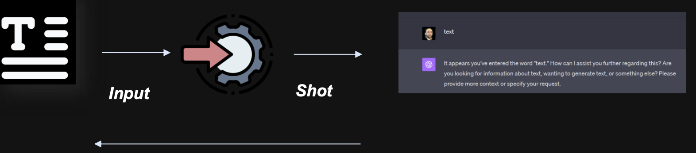

# 🚀 El Valor del Prompt Engineering

  

## 📖 Introducción

Los modelos avanzados tienen una **vasta capacidad**, pero la forma en que se les pregunta o instruye puede afectar significativamente la calidad de sus respuestas. Un buen ingeniero de prompts puede obtener respuestas más precisas y útiles de estos modelos.

---

## 🎯 Aplicaciones del Prompt Engineering

### 🏥 Aplicaciones Específicas
Para aplicaciones especializadas, como **medicina**, **finanzas** o **derecho**, es crucial formular preguntas adecuadamente para obtener respuestas correctas y relevantes. La ingeniería de prompts puede ser esencial en estos campos.

### ⚡ Automatización y Eficiencia
A medida que las empresas buscan automatizar más funciones y mejorar la eficiencia de las existentes con la ayuda de la IA, la capacidad de interactuar efectivamente con modelos de lenguaje se vuelve esencial.

### 💬 Desarrollo de Interfaces Conversacionales
Chatbots, asistentes virtuales y otras interfaces conversacionales dependen de la eficacia de sus interacciones. La ingeniería de prompts juega un papel crucial en la optimización de estas interacciones.

### 🔬 Investigación y Desarrollo
A medida que se desarrollan modelos de lenguaje más avanzados, la investigación sobre cómo interactuar de manera óptima con estos modelos (incluida la ingeniería de prompts) se vuelve más importante.

### 📚 Educación y Formación
En entornos educativos, los modelos de lenguaje pueden ser herramientas valiosas. La capacidad de hacer preguntas efectivas puede mejorar la calidad del material educativo generado.

---

## 🤔 ¿Qué es Prompt Engineering?

> Es esencial para maximizar la utilidad de los modelos en aplicaciones críticas

### 🎨 Definición
Es el **arte**, la **práctica** y el **ejercicio** de diseñar, refinar y optimizar los prompts (o instrucciones) que forman el input para los modelos de lenguaje, como **GPT-4**, con el objetivo de obtener respuestas más precisas, relevantes o útiles bajo un proceso de "Interfacing".

### 🔧 Enfoque Técnico
Es un enfoque utilizado en el campo del aprendizaje automático y la inteligencia artificial para diseñar y optimizar los prompts o indicaciones que se utilizan para interactuar con un modelo de lenguaje o de generación de texto. Consiste en crear instrucciones o textos iniciales precisos y específicos que guíen al modelo para generar la respuesta o el resultado deseado.

### 🎯 Objetivo Principal
El objetivo del prompt engineering es **mejorar la calidad** y la **relevancia** de las respuestas generadas por el modelo, así como influir en su comportamiento y enfoque. Al diseñar prompts efectivos, se pueden obtener resultados más precisos y coherentes, y se puede controlar la salida generada.

---

## 🧠 Conceptos Fundamentales

### 🤖 LLM (Large Language Model)
Son modelos de inteligencia artificial diseñados para procesar y comprender el lenguaje humano en gran escala usando **"Deep Learning Transformers"** en grandes conjuntos de datos de texto, lo que les permite aprender patrones, estructuras gramaticales y significados contextuales del lenguaje.

### ✨ IA Generativa
Se refiere a los sistemas de IA capaces de generar contenido original y nuevo. Estos sistemas utilizan modelos de aprendizaje automático para crear nuevos datos o producir resultados que no han sido vistos anteriormente en su conjunto de entrenamiento.

/Users/isacsbais/Library/CloudStorage/GoogleDrive-natham@bais.cl/Mi unidad/AI PROMPT ENGINEER/images/prompt01.png

---

## 📊 Comparación: AI Tradicional vs AI Generativa

| Aspecto | 🔧 AI Tradicional | ✨ AI Generativa |
|---------|----------------------------------------------|---------------------------------------------|
| **Función Principal** | Analizar y clasificar datos existentes | Crear contenido nuevo y original |
| **Tipo de Output** | Predicciones, clasificaciones | Texto, imágenes, código, audio |
| **Metodología** | Aprendizaje supervisado/no supervisado | Redes generativas, transformers |
| **Aplicaciones** | Reconocimiento de patrones, diagnósticos | Creación de contenido, conversación |
| **Interactividad** | Limitada a respuestas predefinidas | Conversacional y adaptativa |
| **Datos de Entrada** | Estructurados y etiquetados | Texto libre y contextual |
| **Flexibilidad** | Rígida, tareas específicas | Adaptable a múltiples dominios |

---

## 🏆 Beneficios Clave del Prompt Engineering

- 🎯 **Precisión mejorada** en las respuestas
- ⚡ **Eficiencia operacional** en procesos automatizados
- 🔧 **Personalización** de interacciones
- 📈 **Escalabilidad** en aplicaciones empresariales
- 🧠 **Optimización** del rendimiento de modelos IA
- 💰 **Reducción de costos** operativos
- 🚀 **Innovación** en productos y servicios

---

## 📋 Mejores Prácticas

### ✅ **Do's (Hacer)**
- 🎯 Ser específico y claro en las instrucciones
- 📝 Proporcionar ejemplos cuando sea necesario
- 🔄 Iterar y refinar los prompts
- 📊 Medir y evaluar los resultados

### ❌ **Don'ts (No hacer)**
- 🚫 Usar instrucciones ambiguas
- 🚫 Sobrecargar con información irrelevante
- 🚫 Ignorar el contexto del modelo
- 🚫 Olvidar validar las respuestas

---

## 🔮 Futuro del Prompt Engineering

El prompt engineering continuará evolucionando como una disciplina fundamental en el ecosistema de IA, especialmente con el desarrollo de:

- **Modelos multimodales** (texto, imagen, audio)
- **Interfaces más intuitivas** para no-técnicos
- **Automatización** del diseño de prompts
- **Estándares industriales** para mejores prácticas

---

  
  

---

*📅 Última actualización: 2024*  
*👤 Autor: AI Prompt Engineering Guide*  
*📧 Contacto: natham@bais.cl*