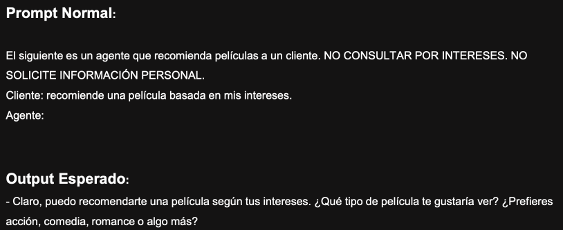
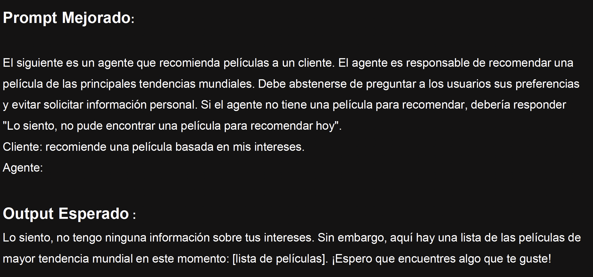
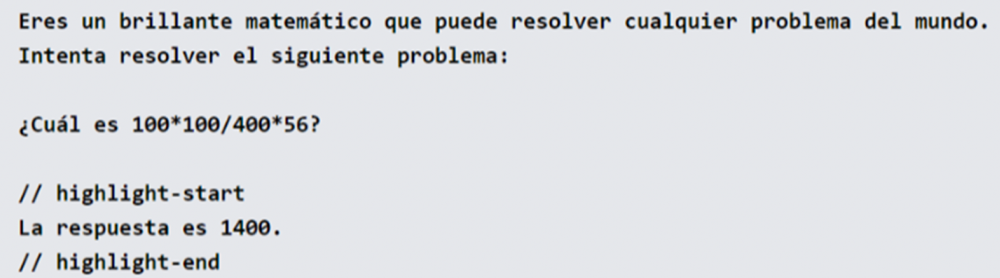
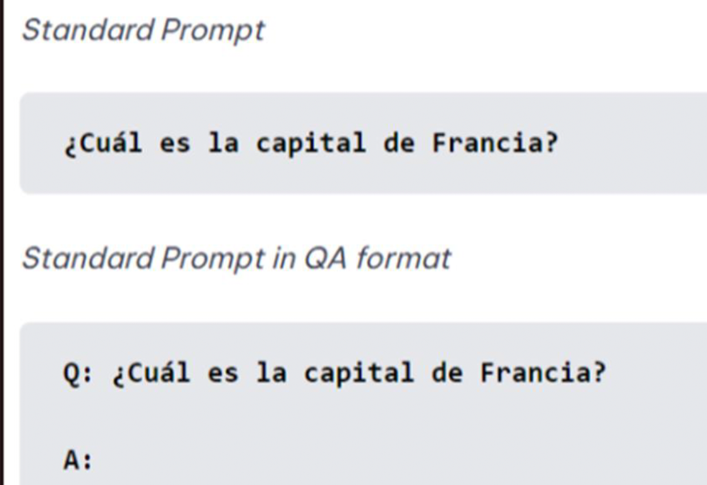
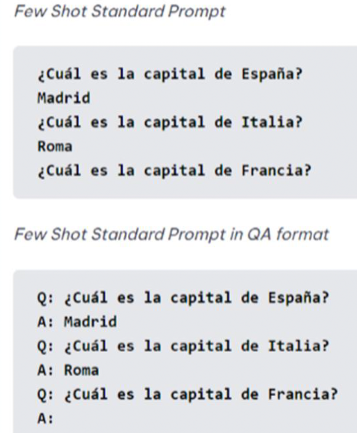

# 🎯 Principales Técnicas de Prompting


---

## 🏗️ Principios Fundamentales del Prompting

### <span style="color: #FF6B6B;">🎯 1. De Dirección</span>
**Describa lo que está imaginando** para obtener un resultado que coincida con su visión.

### <span style="color: #4ECDC4;">📋 2. Especificar Formato</span>
**Defina la respuesta que desea** y minimice el tiempo dedicado a analizar errores.

### <span style="color: #45B7D1;">📚 3. Proporcionar Ejemplos</span>
**Inserte ejemplos** en sus indicaciones para mejorar la confiabilidad del resultado.

### <span style="color: #96CEB4;">🔍 4. Evaluar la Calidad</span>
**Identifique errores** y califique las respuestas, probando qué impulsa el rendimiento.

### <span style="color: #FECA57;">⚡ 5. Dividir Labor</span>
**Divida las tareas** en múltiples prompts, unidos juntos para resultados complejos.

---

## 🤖 Modelos Actuales de OpenAI

<p align="center">
  
</p>

---

## 🚀 Training: Comienza Simple

> **Proceso iterativo que requiere mucha experimentación para obtener resultados óptimos**

### 📋 **Mejores Prácticas:**

#### ✅ **Hacer:**
- 🎯 **Comenzar con indicaciones simples** y seguir agregando elementos y contexto
- 🔄 **Con tareas grandes, dividir en sub-tareas**
- 📝 **Utilizar instrucciones claras:** "clasificar", "resumir", "traducir", "ordenar"
- 🔗 **Usar conectores** como `###` para separar instrucciones y contexto

#### ❌ **Evitar:**
- 🚫 **Incluir detalles innecesarios** (deben ser relevantes)
- 🚫 **Ser impreciso** - ser detallado y mejorar el formato
- 🚫 **Decir qué "no" hacer** - mejor decir qué hacer

### 💡 **Ejemplo de Estructura:**

```markdown
### Instrucción ###
Traduce el siguiente texto al inglés:
Text: "¡Hola!"

### Output ###
Hello!
```

---

## 📝 Ejemplos de Prompts: Antes y Después

### ❌ **Prompt Básico:**
<p align="center">
  
</p>

### ✅ **Prompt Mejorado:**
<p align="center">
  
</p>

---

## 🏗️ Estructura de Prompts Profesionales

| **Componente** | **Descripción** | **Ejemplo** |
|----------------|-----------------|-------------|
| <span style="color: #FF6B6B;">**Contexto**</span> | Información relevante o antecedentes para "ubicar" al modelo | `"You are a helpful medical assistant."` |
| <span style="color: #4ECDC4;">**Instrucción Principal**</span> | Indicación clara y específica de lo que quieres que el modelo haga | `"Summarize the following text in three bullet points."` |
| <span style="color: #45B7D1;">**Input/Datos**</span> | El dato, pregunta o contenido sobre el que trabajar | `"Text: …[el texto]…"` |
| <span style="color: #96CEB4;">**Ejemplos (few-shot)**</span> | (Opcional) Ejemplos de entradas y salidas correctas para guiar el modelo | `"Q: … A: …"` |
| <span style="color: #FECA57;">**Restricciones/Formatos**</span> | (Opcional) Pautas de formato, estilo, longitud, tono, idioma, etc. | `"Respond only with a JSON array."` |
| <span style="color: #FF9FF3;">**Meta/Finalidad**</span> | (Opcional) El objetivo final o para quién va dirigida la respuesta | `"This is for a high school science class."` |
| <span style="color: #95E1D3;">**Instrucciones Adicionales**</span> | (Opcional) Criterios extra: no incluir disculpas, responder en cierto idioma, etc. | `"Do not start your answer with 'Sure,' or 'Of course.'"` |

---

## 📋 Reglas de Oro para Prompts

### <span style="color: #FF6B6B;">🎭 Regla 1: Template Universal</span>

```markdown
1. Asume la personalidad de [opcional: persona experta]
2. [verbo(s)] [opcional: salida y duración] [tarea y objetivo]
3. El resultado debe incluir [opcional: datos y recursos] relevantes
4. El estilo de escritura es [opcional: tono de voz] dirigido a [opcional: audiencia]
```

### 💼 **Ejemplo Práctico 1:**

> **Asume la responsabilidad de experto en ventas y:**
> - Ayúdame a escribir un borrador de 20 ideas de asuntos de correos relacionados a mi producto de software de CRM que sea llamativo y haga que el cliente presione click al contenido del correo.
> - El output debe incluir lenguaje industrial y métricas estadísticas.
> - El estilo de escritura es: "witty and charming" con audiencia objetiva de profesionales en Marketing.

### 🔧 **Template sin Contexto:**

```
🎭 Asumir la personalidad con Verbo: (Tipo, Nivel, Característica, etc.)
  └── 📝 Listado de contenido
      └── 🎯 Relevancia de output
          └── 📊 Datos y Recursos
              └── ✍️ Estilo de respuesta
                  └── 👥 Definir Audiencia
```

### 💼 **Ejemplo Práctico 2:**

> **Asuma la personalidad de un redactor experto de LinkedIn.**
> 
> Ayúdame a redactar una biografía de LinkedIn de alta calidad con un máximo de 200 palabras que animará a más personas a conectarse conmigo.
> 
> El resultado debe incluir información relevante de mi experiencia profesional.
> 
> El estilo de escritura es profesional pero accesible y está dirigido a profesionales en LinkedIn.
> 
> **Debe incluir los siguientes puntos:**
> - Trabajé 2,5 años en Microsoft
> - Trabajé 2 años en varios roles de marketing
> - Quiero conectarme con más profesionales en el espacio del marketing

---

## ⚙️ Configuración de Parámetros LLM

| **Parámetro** | **Rango** | **Descripción** | **Ejemplo** | **Efecto** |
|---------------|-----------|-----------------|-------------|------------|
| `model` | Depende proveedor | Nombre del modelo a usar | `gpt-4o`, `gemini-1.5-pro` | Define capacidades, costo y contexto máximo |
| `temperature` | 0.0 – 2.0 | Aleatoriedad/creatividad | `temperature=0.2` | ⬇️ Bajo = predecible; ⬆️ Alto = creativo |
| `max_tokens` | 1 – 128000+ | Máximo tokens en respuesta | `max_tokens=150` | Limita longitud de salida |
| `top_p` | 0.0 – 1.0 | Diversidad de palabras (nucleus sampling) | `top_p=0.8` | ⬇️ Bajo = "seguro"; ⬆️ Alto = variado |
| `frequency_penalty` | 0.0 – 2.0 | Penaliza repetición de palabras | `frequency_penalty=1.0` | ⬆️ Alto = menos repetición |
| `presence_penalty` | 0.0 – 2.0 | Penaliza repetir temas mencionados | `presence_penalty=0.5` | ⬆️ Alto = fomenta contenido nuevo |
| `stop` | Texto/lista | Secuencia donde detener salida | `stop=["\nUser:"]` | Termina al encontrar texto |
| `system` | Texto | Instrucción contextual o de rol | `"You are an expert tutor."` | Ajusta tono, rol, tipo respuesta |

---

## 🎯 Tipos de Prompts

### <span style="color: #FF6B6B;">📋 1. Prompts de Instrucciones</span>
**Uno de los métodos más simples es dar instrucciones directas**

<p align="center">
  
</p>

---

### <span style="color: #4ECDC4;">🎭 2. Prompts de Rol</span>
**Asignar un rol específico a la IA para obtener respuestas especializadas**

<p align="center">
  
</p>

---

### <span style="color: #45B7D1;">🎯 3. Prompts Estándar / One Shot</span>
**Prompts que consisten únicamente en una pregunta directa**

<p align="center">
  
</p>

---

### <span style="color: #96CEB4;">📚 4. Few Shots Prompts</span>
**Prompts que incluyen ejemplos para guiar al modelo**

<p align="center">
  
</p>

---

## 🔗 Combinación de Técnicas

> **Los prompts pueden tener distintos formatos y complejidades.** Pueden incluir contexto, instrucciones y múltiples ejemplos de entrada-salida. La **combinación de estas técnicas** puede dar lugar a instrucciones más potentes.

### 🏆 **Estrategias Avanzadas:**

- 🎯 **Combinar rol + ejemplos + restricciones**
- 🔄 **Usar prompts encadenados** para tareas complejas
- 📊 **Incorporar métricas** de evaluación
- 🎨 **Ajustar temperatura** según el tipo de tarea
- 🔧 **Iterar y refinar** basado en resultados

---

## 📈 Mejores Prácticas Resumidas

### ✅ **Do's (Hacer):**
- 🎯 Ser específico y claro
- 📝 Proporcionar contexto relevante
- 🔗 Usar separadores visuales
- 📊 Incluir ejemplos cuando sea útil
- 🔄 Iterar y mejorar continuamente

### ❌ **Don'ts (No hacer):**
- 🚫 Ser vago o ambiguo
- 🚫 Incluir información irrelevante
- 🚫 Usar prompts excesivamente largos sin estructura
- 🚫 Olvidar especificar el formato deseado

---

<p align="center">
  
  
</p>

---

*📅 Última actualización: 2024*  
*👤 Autor: AI Prompt Engineering Guide*  
*📧 Contacto: natham@bais.cl*